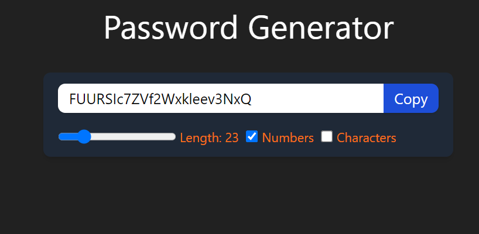
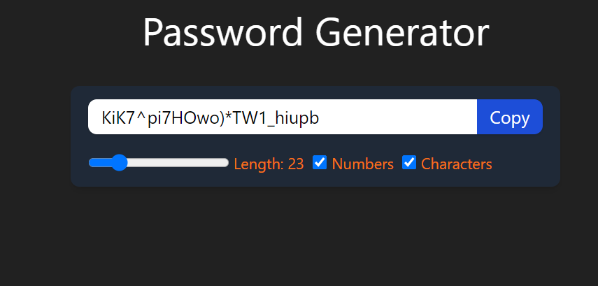

# Password Generator
### Using React + Vite

This app generates password.

## Features
- Variable Length
- With and without numbers included
- With and without special characters allowed

## Result

 
 

## Author

- LinkedIn - [Prabhash Kumar](https://www.linkedin.com/in/prabhash-kumar-405648201/)
- Github - [Prabhashg](https://www.github.com/Prabhashg)
- Frontend Mentor - [@Prabhashg](https://www.frontendmentor.io/profile/Prabhashg)
- Twitter - [@Krprabhasw](https://www.twitter.com/krprabhasw)